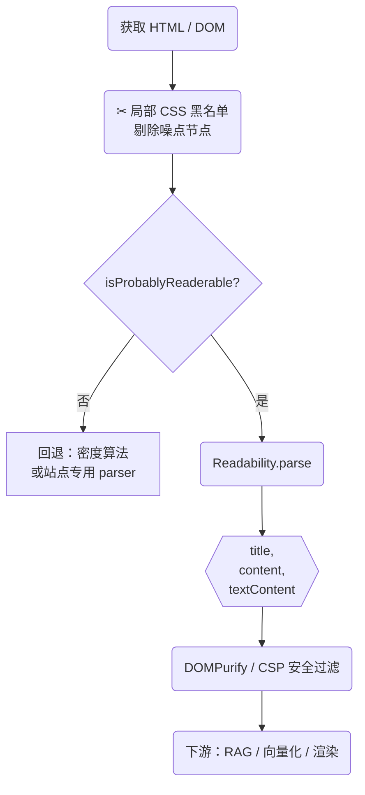

# Readability.js + 局部 CSS 黑名单实现指南

> **场景定位**：浏览器插件、轻量爬虫或任何需要**快速剥离网页正文、去广告噪点**的流水线。  
> 本文给出从架构到代码、规则治理、性能调优的一揽子方案，开箱即可用。

---

## 1 · 总体流程



**关键点**：必须**先**用黑名单去除广告、侧边栏、弹窗；再交给 Readability 评分提取，否则干扰块可能被误判为正文。

---

## 2 · 代码骨架（Node / Browser 通用 TypeScript）

```ts
import { Readability, isProbablyReaderable } from "@mozilla/readability";
import { JSDOM } from "jsdom";
import DOMPurify from "dompurify";

/* ---------- 1. 黑名单规则 ---------- */
const GLOBAL_BLACKLIST = [
  ".ad", ".ads", ".advert", "nav", "footer",
  ".subscribe-modal", "#comments", ".popup"
];

const SITE_RULES: Record<string, string[]> = {
  "weibo.com": [".WB_footer", ".wb_feed_nav"],
  "zhihu.com": [".Post-SideActions", ".Recommended"],
  // …按需扩展
};

/* ---------- 2. 应用黑名单 ---------- */
function applyBlacklist(doc: Document, host: string) {
  const selectors = [
    ...GLOBAL_BLACKLIST,
    ...(SITE_RULES[host] ?? [])
  ];
  if (!selectors.length) return;

  doc
    .querySelectorAll(selectors.join(","))
    .forEach((el) => el.remove());
}

/* ---------- 3. 正文提取核心 ---------- */
export async function extractCleanArticle(html: string, url: string) {
  const dom = new JSDOM(html, { url });
  const doc = dom.window.document;

  const host = new URL(url).hostname.replace(/^www\./, "");
  applyBlacklist(doc, host);                    // ①

  if (!isProbablyReaderable(doc)) {            // ②
    throw new Error("Page not reader‑friendly");
  }

  const reader = new Readability(doc);
  const article = reader.parse();              // ③

  return {
    title: article.title,
    html: DOMPurify.sanitize(article.content), // ④ XSS 安全
    text: article.textContent
  };
}
```

> **浏览器扩展场景**：content‑script 里可直接 `applyBlacklist(document)` → `new Readability(document).parse()`；若是 SPA 需配合 `MutationObserver` 监听路由或新消息节点，仅对增量区域执行。

---

## 3 · 黑名单治理策略

| 维度 | 建议 |
| ---- | ---- |
| **颗粒度** | 全局 `GLOBAL_BLACKLIST` + 站点级 `SITE_RULES` 两层。遇到误杀，只需改动局部数组。 |
| **规则来源** | *人工巡检* + *数据统计自举*：统计「正文外被点击次数 > 阈值」的选择器，自动生成候选黑名单。 |
| **存储 & 分发** | JSON 版本文件托管在 S3/CDN；浏览器扩展启动时拉取并缓存 24 h。 |
| **灰度回退** | 前端提供「标记该块为噪点」反馈按钮，后台收集后灰度更新规则。 |

---

## 4 · 性能与稳定性

1. **批量查询**：`querySelectorAll(selectors.join(","))` 一次性选取，比逐条循环查询快约 1.8×。  
2. **增量处理**：在聊天室、无限滚动页面，仅对**新增节点**执行 `applyBlacklist` + `Readability.parse()`。  
3. **异步渲染**：服务端场景可用 `worker_threads` 或任务队列，把 DOM 运算移至 CPU 辅助进程。  
4. **安全**：Readability 重组原始节点仍可能含脚本，必须通过 DOMPurify 或 CSP 限制执行域。  

---

## 5 · 常见坑 & 调试技巧

| 场景 | 解决方案 |
| ---- | -------- |
| **纯前端 SPA 首屏为空** | Headless 浏览器 `waitForSelector`，或在 content‑script 监听路由跳转后再提取。 |
| **读不出正文** | 调用 `isProbablyReaderable`，若 `false` 则回退到文本密度算法或站点专用 parser。 |
| **误删正文** | DevTools 检查被删节点：`getComputedStyle(el).display`；把误删选择器加入「灰名单」后人工复核。 |
| **Emoji / 特殊字符乱码** | 返回纯文本前执行 `normalize("NFKC")`，并过滤私用区 `\u{E000}-\u{F8FF}`。 |

---

## 6 · 何时需要升级方案

- **复杂排版、多栏报纸、电商详情页**：Readability 准确率下降；可考虑视觉分块（VIPS）或 DOM‑LM 微调模型。  
- **字段级结构化需求**（作者、发布时间、题图）：在 `article.content` 上额外跑正则或 GPT‑Turbo 抽取；或使用商业 Diffbot Article API。  

---

## 7 · 小结

| 特性 | Readability.js | 局部 CSS 黑名单 | 组合价值 |
| ---- | -------------- | --------------- | -------- |
| **作用** | 算法化正文提取 | 站点特定噪声清洗 | 准确率 ≈ 80 %→ 95 % |
| **成本** | 零依赖、轻量 | 规则手动维护 | 低 |
| **性能** | 毫秒级 | O(N) 删除 | 浏览器与 Node 均友好 |

**一句话**：在绝大多数资讯或聊天类网页，`Readability.js + 局部黑名单` 能以极低成本产出**干净、可读、易向量化**的正文，是浏览器插件 & 轻量爬虫的首选组合。祝你实装顺利！  
